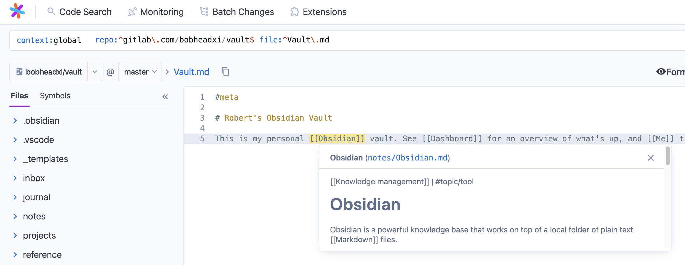

# sourcegraph-knowledge-base (Sourcegraph extension)

Browse Markdown knowledge bases (e.g. [Obsidian vaults](https://obsidian.md/) or [Foam repositories](https://github.com/foambubble/foam/)) in [Sourcegraph](https://about.sourcegraph.com/).

## Roadmap

- Hovers
  - [x] Preview and link to `[[LINK]]` and `[[LINK|ALIAS]]`  Wikilinks
  - [ ] Preview and link anchored `[[LINK#ANCHOR]]` Wikilinks
  - [ ] Metadata and links for `#TAG`s
- Side panes
  - [ ] Browse inbound (backlinks) and outbound links
  - [ ] Browse `#TAG`s in side panes
